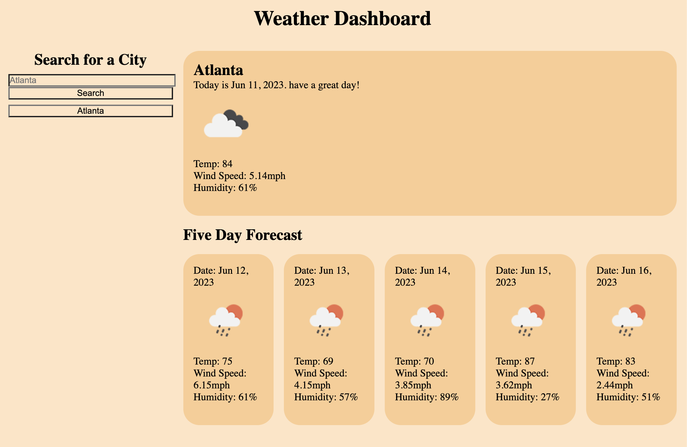

# Weather_Dashboard

This app is for displaying the current day's forecast as well as a 5 day forecast for the selected city. 

## The App

This app featuers a presentation of todays forecast with temp, wind speed, humidity and an icon representing the weather. This info is being pulled from the open weather 3.0 API using geo location and the Onecall apis. The app will remember previous searches for local storage. 

## What I Learned

While developing this app I learned much about calling APIs, and checking different ways to pull the information and display it. This was a really good project to understand APIs. 

## Demo Images

## GitHub Repository

[Weather Dashboard REPO](https://github.com/1willcobb/Weather_Dashboard/)

## Live Site

[Weather Dashboard](https://1willcobb.github.io/Weather_Dashboard/)